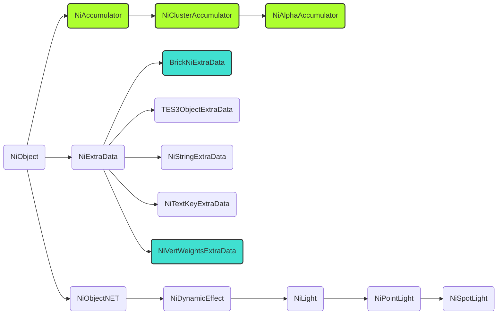

# The Hierarchy of NetImmerse Classes

This page puts into relation various classes that compromise Morrowind's scene graph. Some of these classes are abstract, meaning they aren't directly found in the scene graph, but are used by other classes to inherit common variables and methods. Game's scene graph can be inspected by entering ssg (show scene graph) command in the console. Morrowind's engine is Gamebryo, which was before known as NetImmerse. That's why these classes have prefix ni in their name. These classes in MWSE follow the naming as in the vanilla engine. But, there are some classes that contain information about the scene graph in MWSE and have tes3 prefix such as `tes3vector3`.

The primary building blocks of scene graph are called nodes. Each node has one parent and zero or more child nodes. For example, the base node of the Morrowind's world scene graph, named `worldRoot`, and all the game world objects are represented by nodes that are children of `worldRoot` node.

Note that the relations described here don't reflect how these types are organized in the scene graph. For instance, `worldRoot` node mentioned earlier is of type `niNode`, but is the root node of the world's scene graph, while the base class of most types described here is `niObject`.

The types are arranged into functional groupings. Within each grouping, indentation implies inheritance from the class of the previous indentation level. The color of the taxt carries the following meanings:
 - Turquoise - Classes read by MWSE but not yet exposed to Lua scripts
 - Green - Classes present in Morrowind but not yet read by MWSE
 - All the other classes in standard text color in this list are available in Lua scripts

---

## niMain

### Basic Foundation Types
 - niColor
 - niColorA
 - niPackedColor
 - niRTTI

### Basic Math and Geometry Classes
 - niBound
 - tes3boundingBox
 - tes3matrix33
 - tes3vector2
 - tes3vector3
 - niQuaternion
 - tes3transform

### Templated Container Classes
 - niTArray - not exposed as a type but can be iterated as a standard Lua array.
 - niLinkedList
	- niDynamicEffectLinkedList
	- niNodeLinkedList
	- niPropertyLinkedList

### Animation Classes
 - niObject
	- niTimeController
	- niObjectNET
		- niAVObject
			- niNode
				- niBSAnimationManager
				- niBSAnimationNode
					- niBSParticleNode
		- niSequenceStreamHelper

### Texturing Classes
- niObject
	- niBltSource
	- niObjectNET
		- niTexture
			- niRenderedTexture
				- niRenderedCubeMap
			- niSourceTexture
	- niPalette
	- niPixelData
- niPixelFormat

### Object Depth Sorting Classes
- niObject
	- niAccumulator
		- niClusterAccumulator
			- niAlphaAccumulator

### Geometry Data Classes
- niObject
	- niGeometryData
		- niLinesData
		- niTriBasedGeomData
			- niParticlesData
				- niAutoNormalParticlesData
				- niRotatingParticlesData
			- niTriShapeData
				- niTriShapeDynamicData
			- niTriStripsData

### Geometry Rendering Classes
- niObject
	- niObjectNET
		- niAVObject
			- niGeometry
				- niLines
				- niTriBasedGeometry
					- niTriShape
					- niTriStrips
					- niParticles
						- niAutoNormalParticles
						- niRotatingParticles
	- niScreenPolygon
	- niSkinData
	- niSkinDataBoneData
	- niSkinDataBoneDataVertexWeight
	- niSkinInstance
	- niSkinPartition
	- niSkinPartitionPartition

### Scene Graph Organization Classes
- niObject
	- niExtraData
		- BrickNiExtraData
		- niStringExtraData
		- niTES3ExtraData
		- niTextKeyExtraData
		- niVertWeightsExtraData
	- niObjectNET
		- niAVObject
			- niNode
				- AvoidNode
				- niBillboardNode
				- niBSPNode
				- niSortAdjustNode
				- niSwitchNode
					- niFltAnimationNode
					- niLODNode

### Lightning and Effects Classes
- niObject
	- niObjectNET
		- niAVObject
			- niDynamicEffect
				- niLight
					- niAmbientLight
					- niDirectionalLight
					- niPointLight
						- niSpotLight
				- niTextureEffect

### Rendering and Property Classes
- niObject
	- niObjectNET
		- niAVObject
			- niCamera
		- niProperty
			- niAlphaProperty
			- niDitherProperty
			- niFogProperty
			- niMaterialProperty
			- niRendererSpecificProperty
			- niShadeProperty
			- niSpecularProperty
			- niStencilProperty
			- niTexturingProperty
			- niVertexColorProperty
			- niWireframeProperty
			- niZBufferProperty
	- niRenderer
		- niDX8Renderer

---

## niParticle

### Particle System Classes
- niObject
	- niEmitterModifier - Wo don't have this one
	- niParticleModifier
		- niGravity
		- niParticleBomb
		- niParticleCollider
			- niPlanarCollider
			- niSphericalCollider
		- niParticleColorModifier
		- niParticleGrowFade
		- niParticleRotation
	- niTimeController - Not only related to particles
		- niParticleSystemController
- niPerParticleData

---

## niCollision

### Collision Classes
- niCollisionGroup
- niCollisionGroupRecord
- niObject
	- niObjectNET
		- niAVObject
			- niNode
				- RootCollisionNode
				- niCollisionSwitch
- niPick
- niPickRecord

---

## niAnimation

### Animation Classes
- niObject
	- niColorData
	- niExtraData - Not related to animation
		- niTextKeyExtraData
	- niFloatData
	- niKeyframeData
	- niMorphData
	- niPosData
	- niSequence
	- niTimeController
		- niFlipController
		- niFloatController
			- niAlphaController
			- niRollController
		- niKeyframeController
		- niKeyframeManager
		- niLightColorController
		- niLookAtController
		- niMaterialColorController
		- niMorpherController
			- niGeomMorpherController
		- niParticleSystemController
			- niBSPArrayController
		- niPathController
		- niUVController
		- niVisController
	- niUVData
	- niVisData
- niAnimationKey
	- niColorKey
	- niFloatKey
		- niBezFloatKey
		- niTCBFloatKey
	- niPosKey
		- niBezPosKey
		- niTCBPosKey
	- niRotKey
		- niBezRotKey
		- niTCBRotKey
		- niEulerRotKey
- niTextKey

